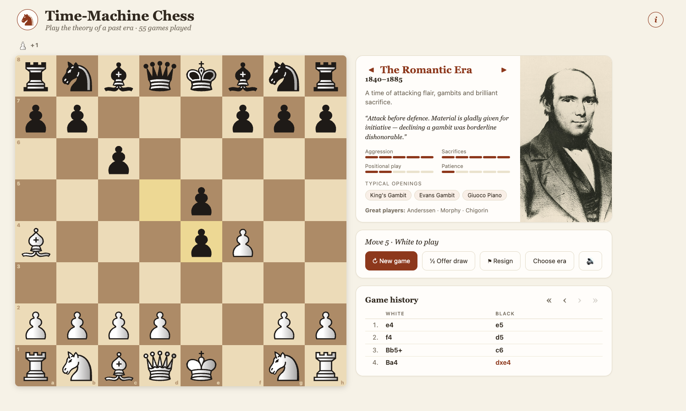
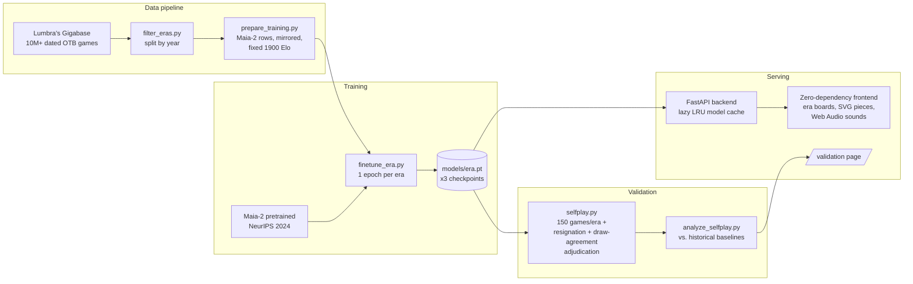

# ♔ Time-Machine Chess

**Play the theory of a past era.** Chess engines fine-tuned on 180 years of history — face the
gambit-happy attackers of 1850, the positional masters of the 1920s, the iron technique of the
Soviet school, the database-armed dynamos of the 1990s, or the engine-hardened grinders of the
2010s. Every era bot is validated against the historical record it was trained on.

[](https://github.com/nickjlamb/time-machine-chess/actions/workflows/ci.yml)
[](LICENSE)
[](https://www.python.org/)
[-6b4a32.svg)](https://github.com/CSSLab/maia2)
[](https://chess.pharmatools.ai)

**▶ Play it now: [chess.pharmatools.ai](https://chess.pharmatools.ai)**

[](https://chess.pharmatools.ai)

---

## Why this exists

Modern engines all play the same way: perfectly. But chess *style* has a history — the King's
Gambit ruled 1850 and vanished by 1950; draws tripled; the English Opening rose from nothing.
Time-Machine Chess asks: **how would masters of each era have approached this position?**

Five [Maia-2](https://github.com/CSSLab/maia2) models, each fine-tuned on games from one era of
over-the-board history:

| Era | Years | Era corpus | Character |
|---|---|---|---|
| ♞ **The Romantic Era** | 1840–1885 | 10.7k games | Gambits, sacrifices, king hunts |
| ♝ **The Classical Era** | 1900–1939 | 62.8k games | Clarity, technique, hypermodern rebellion |
| ♜ **The Soviet Era** | 1950–1985 | 597k games | Preparation, prophylaxis, grinding |
| ♛ **The Engine Dawn** | 1990–1999 | 500k games | Databases, dynamism, the machines watching |
| ♚ **The Engine Era** | 2010–2019 | 500k games | Berlin walls, engine prep, the long grind |

Fine-tuning uses balanced ~10–12k-game subsets per era (~0.8M positions each) so every era
gets comparable training signal; the full corpora provide the validation baselines below.

## The receipts

Each bot played 150 self-play games; identical move-sequence metrics were computed on the bot
games and on random samples of the historical corpora. The era gradients reproduce:

| Metric | Romantic (hist → bot) | Classical (hist → bot) | Soviet (hist → bot) | Engine Dawn (hist → bot) | Engine Era (hist → bot) |
|---|---|---|---|---|---|
| King's Gambit rate | 14.0% → **18.0%** | 3.5% → **9.3%** | 1.25% → **0.0%** | 0.75% → **0.0%** | 0.0% → **0.0%** |
| 1.e4 / 1.d4 / 1.c4 | 88/6/3 → 95/5/0 | 48/40/6 → 67/27/3 | 50/28/11 → 70/17/11 | 46/38/5 → 63/29/5 | 48/38/8 → 54/38/8 |
| Draw rate | 12.0% → **15.3%** | 25.0% → **24.7%** | 28.75% → **26.0%** | 31.75% → **34.7%** | 31.75% → **28.7%** |
| Avg game length (plies) | 73.9 → **79.1** | 77.5 → **74.5** | 72.7 → **69.1** | 75.2 → **70.8** | 78.4 → **78.0** |

Full analysis, honest residuals included: [`validation/baselines.md`](validation/baselines.md)
and the [live validation page](https://chess.pharmatools.ai/validation).

## Quick start (under 60 seconds)

```bash
git clone https://github.com/nickjlamb/time-machine-chess.git
cd time-machine-chess
pip install -r requirements.txt
uvicorn backend.app:app          # open http://localhost:8000
```

That runs immediately with lightweight heuristic bots. For the real trained era models
(~520MB, one command):

```bash
pip install maia2 torch
python3 scripts/fetch_models.py  # downloads the fine-tuned checkpoints from Releases
```

## Architecture



Design choices worth knowing: policy-head sampling with **no search** (human-like by
construction, CPU-cheap); full-diversity temperature in the opening, sharpened after (era
character lives in opening *diversity*); fixed 1900-Elo conditioning since historical games lack
ratings (eras differ in **style**, not strength); optimistic client-side move rendering for
zero-latency play; draws and resignation modeled as **social behavior** — era-specific
thresholds on the model's own win-probability head (the Soviet school agrees draws
readily and resigns promptly; Romantics almost never agree and play on toward the
mate), with the draw and resignation constants tuned jointly since they interact.

## API examples

```bash
# What eras exist?
curl -s localhost:8000/api/eras | jq keys

# Ask the Romantic era to respond to 1.e4 e5 2.f4 (it will probably accept)
curl -s -X POST localhost:8000/api/move -H 'Content-Type: application/json' \
  -d '{"era":"romantic","fen":"rnbqkbnr/pppp1ppp/8/4p3/4PP2/8/PPPP2PP/RNBQKBNR b KQkq - 0 2"}'

# Play a move and get the era's reply in one call
curl -s -X POST localhost:8000/api/play -H 'Content-Type: application/json' \
  -d '{"era":"soviet","fen":"<any FEN>","move":"e2e4"}'

# Offer the Soviet era a draw (it wants a dead-equal streak first — see backend/draws.py)
curl -s -X POST localhost:8000/api/draw-offer -H 'Content-Type: application/json' \
  -d '{"era":"soviet","fen":"<any FEN>","drawStreak":6}'
```

## Train your own era

<details>
<summary>Full pipeline (data → training → validation)</summary>

1. **Data**: download dated PGNs (e.g. [Lumbra's Gigabase](https://lumbrasgigabase.com) OTB
   time-range files), then `python3 scripts/filter_eras.py data/master_games.pgn`.
   Era windows live in `config/eras.yaml`.
2. **Baselines**: `python3 scripts/corpus_stats.py`
3. **Training rows**: `python3 scripts/prepare_training.py <era>`
4. **Fine-tune**: `python3 training/finetune_era.py <era>` (GPU or Apple Silicon `--device mps`;
   one epoch ≈ minutes). Held-out accuracy must beat the pre-finetune baseline.
5. **Gate**: `python3 -m scripts.sanity_gate` — eras must be stylistically distinguishable.
6. **Validate**: `python3 scripts/selfplay.py <era> --games 150` then
   `python3 scripts/analyze_selfplay.py`; results render at `/validation`.

Add a new era by extending `config/eras.yaml` — the pipeline picks it up end to end.
</details>

<details>
<summary>Deployment (Railway/Docker)</summary>

The `Dockerfile` pulls model weights from the GitHub release at build time (weights are not in
git). `railway.json` configures the healthcheck. `MAX_LOADED_MODELS=1` keeps RAM ~1GB by
LRU-swapping era models (~2s swap). See the file comments for details.
</details>

## Roadmap

- [ ] **Year slider** — one era-conditioned model instead of three checkpoints, play any year
- [x] **The Engine Dawn (1990–1999)** — the 4th era: databases, dynamism, and peak
      grandmaster-draw culture; validated in range on the first run (v0.4.0)
- [x] **The Engine Era (2010–2019)** — Berlin endgames and the Carlsen grind; the closest
      length match of any era (78.0 vs 78.4 plies) and 1.c4 at exactly the historical 8.0% (v0.5.0)
- ~~**Pre-1840 prehistory**~~ — officially data-starved: only ~670 OTB game scores survive
      from before 1840 (many at odds), because systematic recording began with the first
      chess magazines in the late 1830s. The past kept poor receipts.
- [ ] **Era commentary** — "a Romantic would never decline this gambit" move annotations
- [x] **Draw-agreement modeling** — era draw culture from the win-prob head; draw rates
      within ~3 points of history in every era (v0.2.0, co-tuned with resignation in v0.3.0)
- [x] **Era-accurate resignation manners** — era thresholds on the win-prob head; the bot
      can resign to you in live play; avg game length within ~5 plies of history (v0.3.0)
- [ ] Mobile PWA polish

## Contributing

PRs welcome — see [CONTRIBUTING.md](CONTRIBUTING.md). The most valuable contributions right now
are new era definitions, better era-signature metrics, and frontend polish. Run `pytest` before
submitting; CI runs the same suite.

## License & attribution

Code: [MIT](LICENSE) © Nick Lamb. Built on [Maia-2](https://github.com/CSSLab/maia2) (MIT,
CSSLab, University of Toronto — [paper](https://arxiv.org/abs/2409.20553)).
Training data: [Lumbra's Gigabase](https://lumbrasgigabase.com) (CC BY-NC-SA 4.0, not
redistributed here). Piece sets via [lichess-org/lila](https://github.com/lichess-org/lila):
Merida (A. H. Marroquin), Alpha (E. Bentzen), cburnett (C. M. L. Burnett) — fetch with
`python3 scripts/fetch_pieces.py`; each retains its original license.
Sounds are synthesized in-browser with the Web Audio API — no audio files, no licenses.
